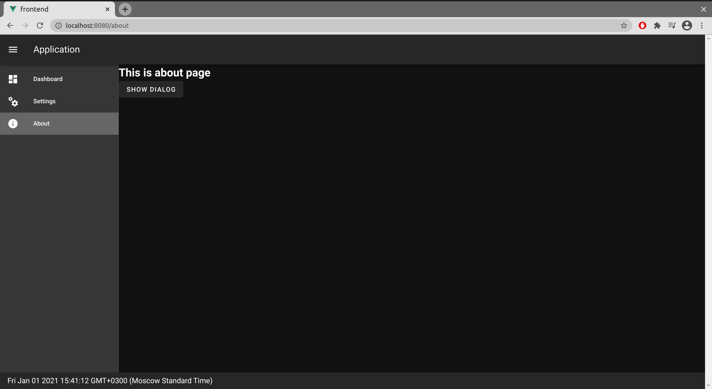

# Spring + Vuetify Template

## Run

Build frontend:  
>npm must be installed ([with node.js](https://nodejs.org)).

    cd frontend
    npm run build
 
Run backend:

    cd ../backend

on Linux

    ./mvnw clean spring-boot:run

or on Windows

    mvnw.cmd clean spring-boot:run

See result in browser:

    http://localhost:8080

## How to

Create frontend for example with [Vue CLI](https://cli.vuejs.org/guide/installation.html) 

    vue create frontend --no-git

Add [vuetify](https://vuetifyjs.com/en/getting-started/installation/)

    vue add vuetify

Create backend with [spring initializr](https://start.spring.io/). Dependencies: `Spring Web`. Put result in `/backend`.

Modify `/backend/pom.xml` to manage frontend files. [More here](https://github.com/Worrovsky/spring-vue-demo)

